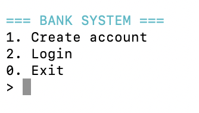
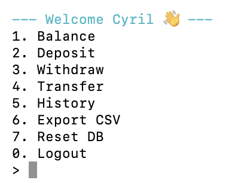
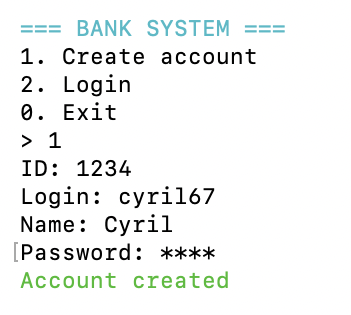
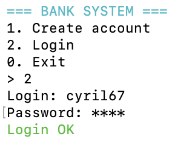
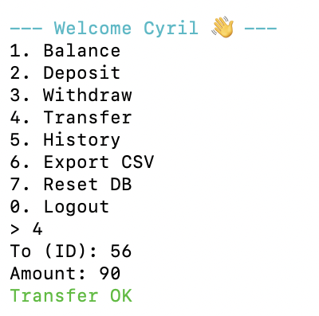
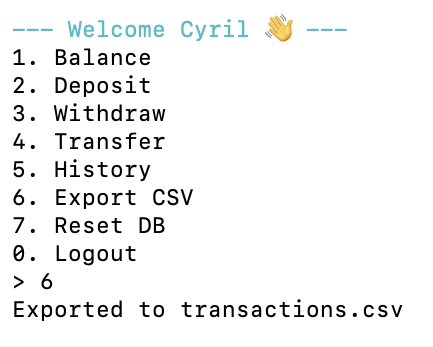
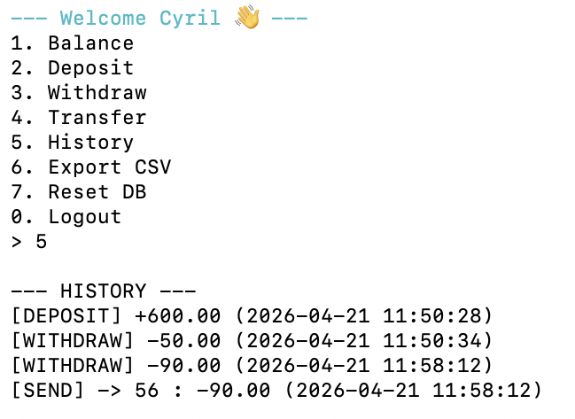
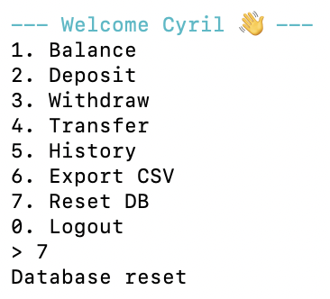

# 💳 My Banking System (CLI)


 

A minimal banking system written in C, featuring account management, transactions, and a terminal-based user interface.

---

## 🚀 Features

- Create account (ID, login, name, password)
- Secure login (hidden password input 🔒)
- Check balance
- Deposit money
- Withdraw money (with validation)
- Transfer money between accounts
- Transaction history with timestamps 📅
- Export transactions to CSV 📊
- Reset database

---

## 🛠️ Tech Stack

- C (low-level programming)
- File-based database (`accounts.db`, `transactions.db`)
- ANSI escape codes (colored terminal output)

---

## 📂 Project Structure

```sh
.
├── include/
│   ├── account.h
│   └── database.h
├── src/
│   ├── account.c
│   ├── database.c
│   └── main.c
├── Makefile
├── accounts.db
└── transactions.db
```
---
## 🎯 What I learned

- Building a backend in C
- Handling HTTP requests manually
- Connecting C to PostgreSQL
- Designing a simple banking system
---
## 🔨 Build
```sh
make
```

## ▶️  Run
```sh
./bank
```
## 🎮 Example Usage

```sh
=== BANK SYSTEM ===
1. Create account
2. Login
0. Exit
> 1
ID: 1234
Login: cyril67
Name: Cyril
Password: ****
Account created
```

## 📊 Transactions Example
```sh
[DEPOSIT] +100.00 (2026-04-21 11:32:10)
[WITHDRAW] -50.00 (2026-04-21 11:33:02)
[SEND] -> 2 : -20.00 (2026-04-21 11:34:15)
```
## 📸 Screenshots

### 🧭 Menu
<p align="center">
  
</p>

---

### 🔐 Login Flow
<p align="center">
  
  
  
</p>

---

### 📊 History Flow
<p align="center">
  
  
  
  
</p>
